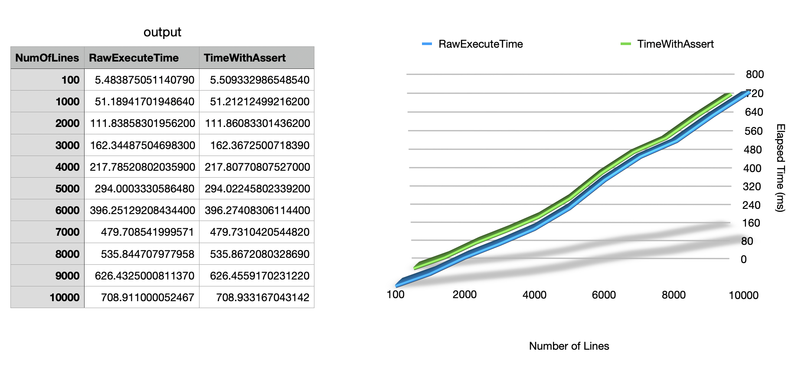

# Part 3 Report

## [Repo URL](https://github.com/failury/ssw567-final-group-3)

#### Related Source File:

- ##### perfTest.py: code for executing performance tests and generating csv results

- ##### MRTD.py: the tested code

we have to do perf testing on two given files records_encoded.json and records_decoded.json.
we are using same functionality from part 2, but we need to rearrange some functions so that it'll easy to handle strings. we have combined few functions and add other functionality for encode and decode. 

Function Implementation
- class HardwareScanner(): An empty class function for hardware scanner that will be mocked to return actual values during testing.
- decode(): A function that takes 2 MRZ Strings as its inputs from HardwareScanner() and returns a string of 'check digits concatenated together'.
- class dummydatabase(): An empty class function for database scanner that will be mocked to return actual values during testing.
- encode(): A function that takes 2 dictionary lines as input from the dummydatabase() and returns a string of 'check digits concatenated together'.
- getCheckCode(inputString: str) -> int: return the correct check code for the given string
- compare_EndDec(): A function that compares the check digit output of both encode() and decode() and then it reports if any mismatch is found in the corresponding fields of those check digits.

## [Excel File URL](https://github.com/failury/ssw567-final-group-3/blob/main/PART3/Graph.xlsx)

## Explanation and Observation:

The above chart shows the trends of timestamps vs number of executed code. Based on the generated chart we can see that for both raw execute time and execute time with assertions, the trend is similar and grow linearly, while the timestamp of execute time with assertions are generally  greater than the timestamp of raw executing time, the difference is minimal.
